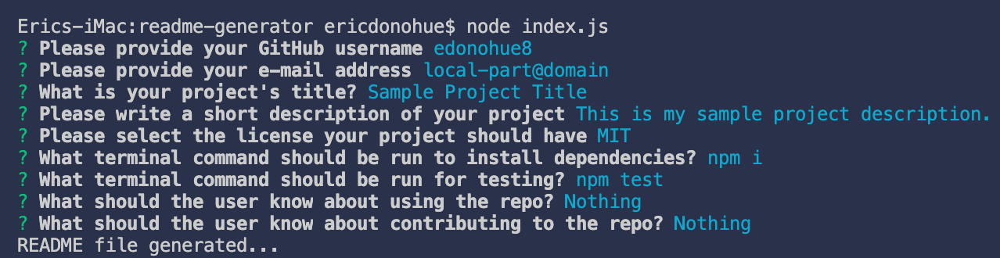
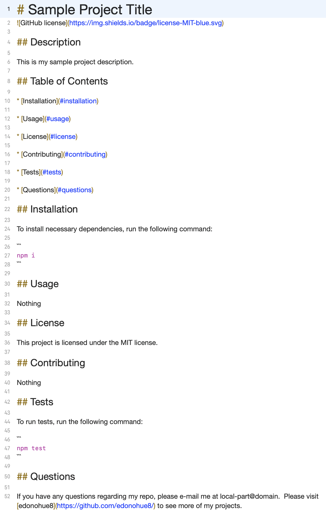

# Good README Generator

## Description

My assignment was to create a command-line app that when completed, generates a README.md file based on the user's input utilizing the [Inquirer package](https://www.npmjs.com/package/inquirer).  The application would be initialized by entering the command:

```
node index.js
```

## Table of Contents 

* [Installation](#installation)

* [Tests](#tests)

* [Steps](#steps)

* [Demo](#demo)

* [Screenshots](#screenshots)

* [Author](#author)

## Installation

To install necessary dependencies, run the following command:

```
npm i
```

## Tests

To run tests, run the following command:

```
npm test
```

## Steps
### My Process

My first step was to work in the index.js file and create my const declarations.  Next, I created a series of questions that would be prompted to the user in the terminal.  I then created functions to write the README file and to initialize the program.

Afterwards, I created functions in my generateMarkdown.js file.  This included rendering the license badge, link, and section.

Lastly, I used [Screencastify](https://www.screencastify.com/) to record a demonstration of myself illustrating how the app functions and generates a README.md file.

## Demo
### Video Demonstration Link
[Click here](https://drive.google.com/file/d/1T7qJRYQKYkeDeAxpVWNCArM7ATNqbCcF/view?usp=sharing)

## Screenshots

* **Terminal**


* **Sample README file**


## Author

* **Eric Donohue**

### Other Projects

Please visit [edonohue8](https://github.com/edonohue8/) to see more of my projects.

